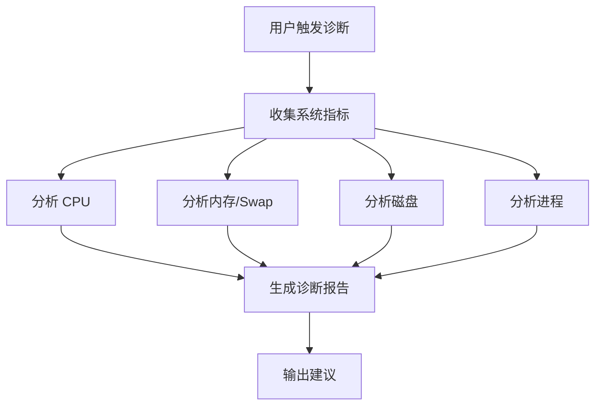

# 系统卡顿诊断工具

## 📋 功能概述

快速诊断 Linux 系统卡顿问题，检测 CPU/内存/Swap/磁盘瓶颈，给出安全的优化建议。

**核心能力：**
- ✅ 全面系统性能诊断（CPU、内存、Swap、磁盘）
- ✅ 智能识别卡顿原因和瓶颈类型
- ✅ 进程智能分类（自动识别 WPS、企业微信等常见应用）
- ✅ 安全优化建议（绝不推荐关闭系统核心服务）
- ✅ 中文友好输出，易于理解

---

## 🎯 Claude 助手执行指南

**重要：当用户触发以下任一关键词时，请立即执行本 skill：**
- 系统卡不卡
- 系统卡顿诊断
- 检测系统负载
- 系统性能检查
- 看看机器卡不卡
- 分析系统性能

### 标准执行流程

#### 步骤 1：执行诊断脚本

```bash
bash ~/.claude/skills/diagnose_system_lag/scripts/diagnose.sh
```

此脚本会自动：
1. 收集系统指标（CPU、内存、Swap、磁盘、进程）
2. 分析瓶颈原因
3. 生成诊断报告到 `reports/` 目录
4. 记录日志到 `logs/` 目录

#### 步骤 2：读取并分析报告

```bash
# 读取最新生成的报告
cat $(ls -t ~/.claude/skills/diagnose_system_lag/reports/diagnose-*.txt | head -1)
```

#### 步骤 3：向用户展示结果

**展示格式要求：**
1. **先说结论**（1-2 句话总结是否卡顿及主要原因）
2. **关键指标**（Load、CPU、内存、Swap、磁盘）
3. **TOP 进程列表**（简化版，列出前 5-10 个）
4. **优化建议**（如果有问题，给出具体操作建议；如果正常，简单说明）

**输出风格：**
- 使用中文
- 简洁直接，避免冗长
- 标注危险指标 ⚠️
- 必要时给出具体命令

### 用户自行调用模式

用户也可以直接在命令行执行：

```bash
# 执行诊断
bash ~/.claude/skills/diagnose_system_lag/scripts/diagnose.sh

# 查看报告
cat ~/.claude/skills/diagnose_system_lag/reports/diagnose-*.txt
```

---

## 🔍 诊断内容

### 1. 系统指标收集

自动收集以下数据：
- 系统负载（load average）
- CPU 核心数和使用率
- 内存和 Swap 使用情况
- 磁盘空间使用率
- TOP 进程列表（按内存/CPU 排序）

### 2. 智能分析

**CPU 维度：**
- 负载超过核心数 1.5 倍 + 空闲率 <20% → **CPU 瓶颈**
- 负载高 + 空闲率 >60% → **I/O 瓶颈**
- iowait >5% → **磁盘 I/O 瓶颈**

**内存维度：**
- Swap 使用 >=50% 或 >=2GB → **内存压力严重**
- 可用内存 <20% 或 <2GB → **内存紧张**

**磁盘维度：**
- 根分区或 home 分区 >=90% → **满盘风险**

### 3. 进程识别

智能识别常见应用：

| 应用类型 | 识别关键字 |
|---------|-----------|
| Gemini 客户端 | gemini |
| WPS 办公套件 | wps, wpp, et |
| 企业微信 | WXWork, WeMail |
| 终端工具 | warp-terminal |
| 编辑器 | typora, code, cursor |
| 浏览器 | chrome, chromium, firefox |
| 代理工具 | clash |

**安全过滤：**绝不推荐关闭以下系统服务：
- 图形服务：Xorg, wayland
- 桌面环境：deepin-kwin, dde-*
- 输入法：fcitx5, ibus
- 系统服务：systemd, dbus, NetworkManager

---

## 📊 输出格式

### 诊断报告结构

1. **诊断结论**（1-2 句话总结问题）
2. **系统资源概览**（关键指标列表）
3. **TOP 进程列表**（内存占用排序）
4. **优化建议**（分短期/中期）

### 示例输出

```
═══════════════════════════════════════════════════════════
  系统卡顿诊断报告
═══════════════════════════════════════════════════════════

## 📋 诊断结论

**您的系统目前运行流畅，没有明显卡顿现象。**

## 📊 系统资源概览

- Load Average: 1.62, 1.44, 1.58 (CPU 核心数: 8)
- CPU 使用: 28.7% user, 13.9% system, 56.4% idle
- 内存: 14Gi 总 / 7.5Gi 已用 / 7.1Gi 可用
- Swap: 4.0Gi 总 / 170Mi 已用 ✅

## 💡 优化建议

当前系统运行正常，无需优化。
```

---

## 🛠️ 工作流程

### 诊断流程



### 文件输出

- **报告**: `reports/diagnose-YYYYMMDD-HHMMSS.txt`
- **日志**: `logs/diagnose-YYYYMMDD-HHMMSS.log`

---

## ⚙️ 配置选项

配置文件：`config/default.conf`（未来版本支持）

计划支持的配置项：
```bash
# CPU 负载阈值系数
CPU_THRESHOLD_FACTOR=1.5

# Swap 使用警告阈值（GB）
SWAP_WARNING_GB=2

# 磁盘使用警告阈值（%）
DISK_WARNING_PERCENT=90

# 报告保留天数
REPORT_RETENTION_DAYS=30
```

---

## 🔒 安全承诺

1. **只读操作**：仅收集系统信息，不修改任何配置
2. **无自动执行**：所有优化建议需用户手动执行
3. **安全过滤**：绝不建议关闭系统核心服务
4. **明确提示**：执行 kill 命令前提醒保存工作

---

## 📖 详细文档

- **快速开始**: 查看 [README.md](./README.md)
- **脚本源码**: `scripts/diagnose.sh`
- **诊断报告**: `reports/`
- **运行日志**: `logs/`

---

## 🆘 使用示例

### 场景1：系统卡顿排查

```
用户: 机器很卡，帮我看看怎么回事
助手: 我来执行系统诊断...
      [运行 diagnose.sh]

      诊断结果：
      - 主要原因：Swap 大量使用（已用 3.2GB）
      - 建议：关闭部分大内存应用释放空间

      具体建议：
      1. 关闭 Gemini 客户端（释放 ~2.6G）
      2. 关闭 WPS 办公套件（释放 ~850M）
```

### 场景2：日常健康检查

```
用户: 系统性能检查
助手: 执行诊断...

      系统运行正常：
      - CPU 负载: 1.62 (核心数: 8) ✅
      - 内存使用: 48% ✅
      - Swap 使用: 4% ✅
      - 磁盘空间: 84% ⚠️ (建议清理)
```

---

## 🔄 版本历史

- **v2.0.0** (2026-01-06)
  - 重构为标准 skill 目录结构
  - 分离脚本和文档
  - 添加报告和日志输出
  - 改进诊断逻辑

- **v1.0.0** (初始版本)
  - 基础诊断功能
  - 提示词驱动模式

---

**维护者**: user | **许可证**: MIT
